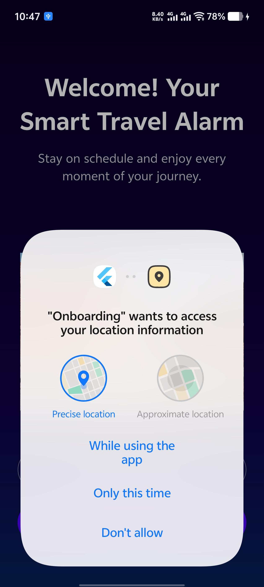
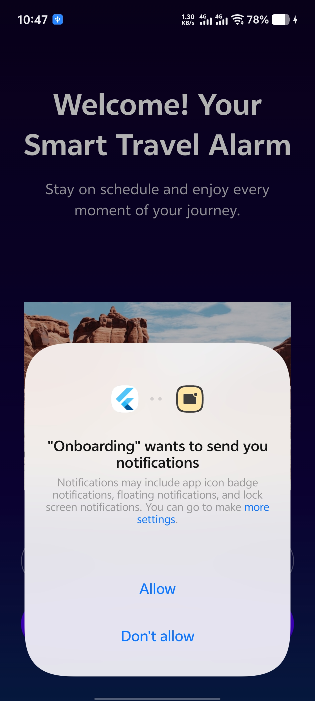
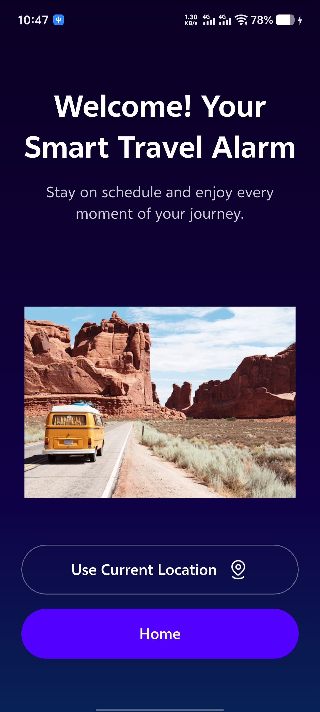
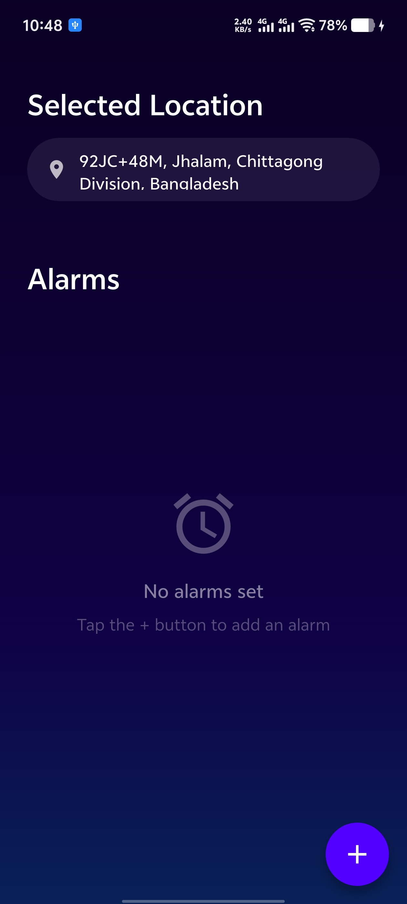
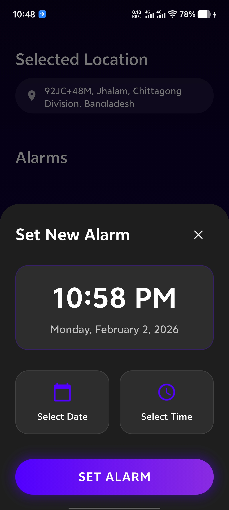
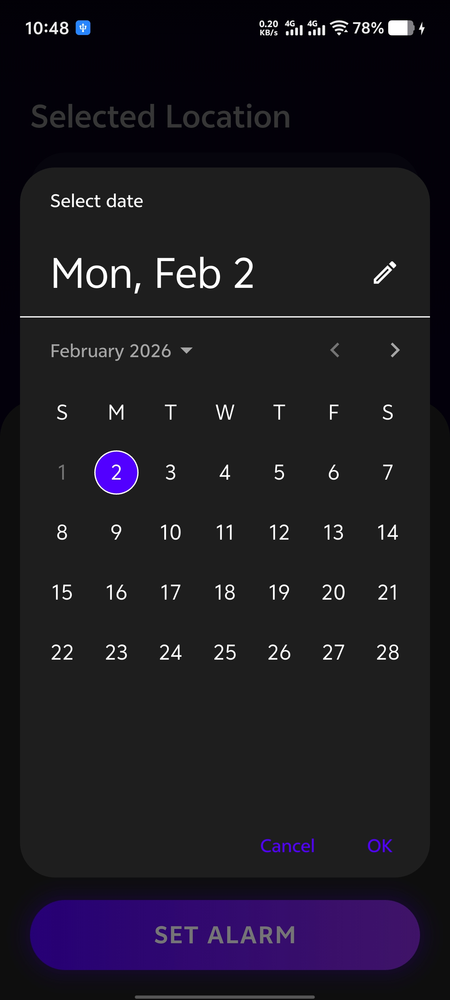
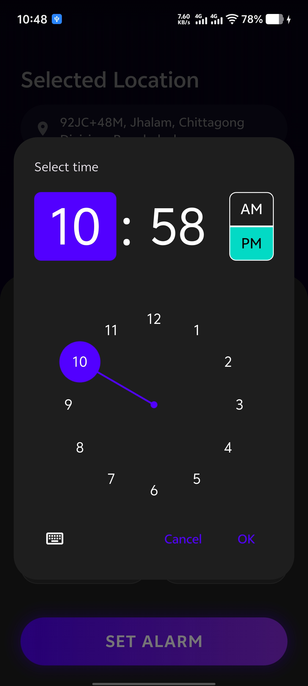
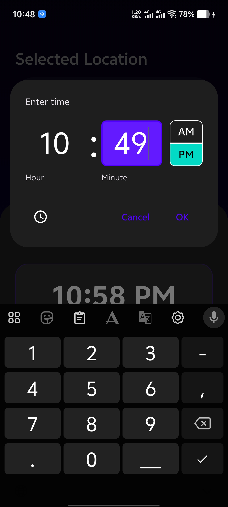
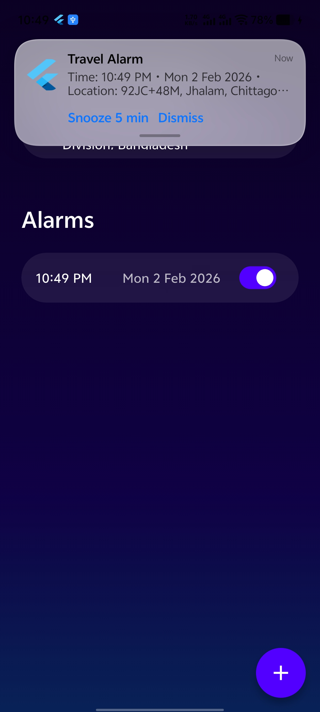
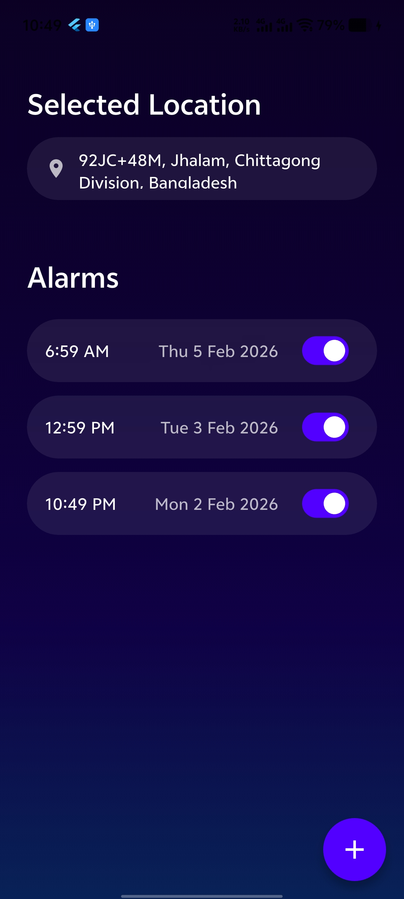

# Onboarding (Travel Alarm APP)
<h4 align="center">Never miss a moment, never be late for an adventure!</h4>

### ✨ What is Travel Alarm?
Travel Alarm is not just another alarm app – it's your intelligent travel companion designed specifically for modern travelers, commuters, and adventure seekers. Born from the realization that traditional alarms lack context and personalization, Travel Alarm integrates real-time location intelligence with smart scheduling to ensure you're always on time for what matters most.

### 🌟 Why Travel Alarm Stands Out?
#### 🗺️ Location-Aware Alarms
Unlike standard alarm apps, Travel Alarm remembers where your alarms are set. Whether it's catching a flight at the airport, meeting friends at a café, or starting a road trip from home – each alarm is tied to a specific location, giving your reminders meaningful context.

#### ⏰ Intelligent Scheduling
Set alarms with our beautiful, intuitive date-time picker featuring a sleek dark theme. Visualize your upcoming schedule at a glance and manage all your travel commitments in one place.

#### 📍 Smart Location Services
- Automatic Location Detection: Get your current address with precision
- One-Tap Refresh: Update location with a single tap
- Location History: Your frequently used locations are remembered

## App Screenshots

| Onboarding Screen-1 | Onboarding Screen-2 | Onboarding Screen-1 |
|-------------|--------------|----------|
|  |  |  |


| Location access permission Screen | Notification Permission Screen | Wellcome screen |
|-------------|--------------|----------|
|  |  |  |


| App Home Page | Alarm Create screen | Select date widget |
|-------------|--------------|----------|
|  |  |  |


| Time selection widget by clock formate | Time selection widget by input | Scheduled travel alarm notification |
|-------------|--------------|----------|
|  |  |  |


| Show all alarm |
|-------------|
|  |

## Tools/packages used
### 📱 Flutter Framework & Core
- **Flutter SDK** — UI framework  
- **Dart** — Programming language 
--
### 🎨 UI & Design
- **Material Design** — UI components
- **Cupertino Icons** — cupertino_icons: ^1.0.8
- Custom Fonts (Inter, Oxygen)
--
### 🔧 State & Storage
- **Shared Preferences** — Local storage for simple data
```yaml
shared_preferences: ^2.2.2
```
- **Path** — File path utilities
```yaml
path: ^1.8.3
```
### 📍 Location Services
- **Geolocator** — Location access & permissions
```yaml
geolocator: ^11.0.0
```
- **Geocoding** — Address to coordinates conversion
```yaml
geocoding: ^2.2.0
```

### 🔔 Notification System
- **awesome_notifications** — Local notifications
```yaml
awesome_notifications: ^0.10.1
```
- **timezone** — Timezone handling
```yaml
timezone: ^0.9.3
```
- **permission_handler** — Permission management
```yaml
permission_handler: ^11.0.0
```

### 🎥 Video / Media
- **Chewie** — Video player controller
```yaml
chewie: ^1.5.0
```
- **Video Player** — Video playback
```yaml
video_player: ^2.8.3
```

### 🌐 Internationalization
- **intl** — Date/time formatting
```yaml
intl: ^0.18.0
```

## Installation Guidelines 

```dart
flutter pub get
flutter run
